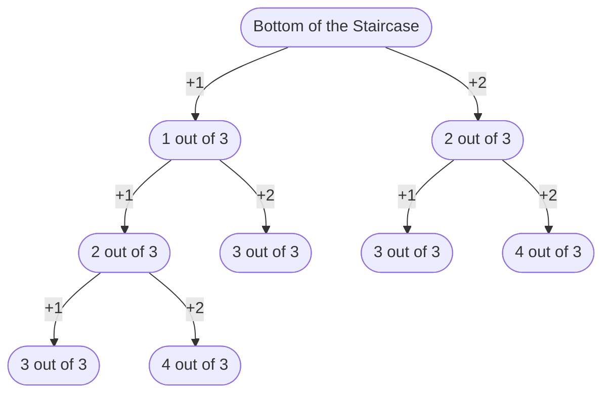

::: slot header

# Climbing Stairs Solution 1

:::

## Links

<a href="https://leetcode.com/problems/climbing-stairs/" target="_blank" rel="noopener noreferrer">Climbing Stairs 
Problem&nbsp;💡
</a>

<a href="https://github.com/codemonkeysio/LeetCode" target="_blank" rel="noopener noreferrer">Get the code & notes on 
GitHub&nbsp;💻
</a>

<a href="https://discord.gg/mh9rQmwJ8H" target="_blank" rel="noopener noreferrer">Ask Questions & Share Solutions in 
Discord&nbsp;🤖
</a>

## Problem Description

You are climbing a staircase. It takes n steps to reach the top.

Each time you can either climb 1 or 2 steps. In how many distinct ways can you climb to the top?

## Examples

Ex 1) Input: n = 2 $\implies$ Output: 2

Explanation: There are two ways to climb to the top. 1. 1 step + 1 step 2. 2 steps

Ex 2) Input: n = 3 $\implies$ Output: 3

Explanation: There are three ways to climb to the top. 1. 1 step + 1 step + 1 step 2. 1 step + 2 steps 3. 2 steps + 1 step

## Constraints

- $1 \leq \color{#ebeb33}{n} \leq 45$

## Thought Process

- Let's start by diagramming the different ways we can climb the steps to see if we can find a pattern.

  - When n = 3 we have:

- From the diagram we can see there are 3 distinct ways to climb to the top when n = 3 since we can ignore the scenarios where we take extra steps.

- To help you see a pattern try drawing out more diagrams for larger values of n or creating a generalized diagram for any value of n.

- The diagram above is an example of a recursion tree.

- So, one way to solve this problem is to come up with a recursive formula that represents how many distinct ways we can climb the stairs.

- Let's use the diagram to help us come up with our recursive formula.

- We know we can either add 1 step or 2 steps each time we climb up the stairs, and we want to hit our target of n steps.

- So, we need to keep track of how many steps we have taken which we can represent with the variable $\color{#33eb61}{stepsTaken_c}$, where $\color{#33eb61}{c}$ represents the current choice when climbing the stairs.

- Initially, $\color{#33eb61}{stepsTaken_0} = \color{#33eb61}{0}$, here $\color{#33eb61}{c} = \color{#33eb61}{0}$ means we haven't made a choice to take 1 step or 2 steps yet.

- Each time we climb the stairs we make one of the following choices:

$$\color{#33eb61}{stepsTaken_c} = \color{#33eb61}{stepsTaken_{c - 1}} + 1, \; \; for \; \; \color{#33eb61}{c} > \color{#33eb61}{0}$$

$$or$$

$$\color{#33eb61}{stepsTaken_c} = \color{#33eb61}{stepsTaken_{c - 1}} + 2, \; \; for \; \; \color{#33eb61}{c} > \color{#33eb61}{0}$$

- Now, we'll let $\color{#33ebeb}{wayToClimb}$ denote our function for climbing the stairs.

- Here's how we can represent the different scenarios for climbing the stairs:

$$\color{#33ebeb}{wayToClimb}(\color{#33eb61}{stepsTaken_{c - 1}} + 1, \color{#ebeb33}{n}) + \color{#33ebeb}{wayToClimb}(\color{#33eb61}{stepsTaken_{c - 1}} + 2, \color{#ebeb33}{n}), \; \; for \; \; \color{#33eb61}{c} > \color{#33eb61}{0}$$

- We're passing the $\color{#33eb61}{stepsTaken_{c - 1}}$ + $\color{#cc99ff}{nextStepSize}$ and our target value of $\color{#ebeb33}{n}$ steps to our function $\color{#33ebeb}{wayToClimb}$.

- Now, we need to determine how many times we need to to call $\color{#33ebeb}{wayToClimb}$.

- We know from the diagram if $\color{#33eb61}{stepsTaken_c} > \color{#ebeb33}{n}$, then we can ignore that way of climbing the stairs

- We also know if $\color{#33eb61}{stepsTaken_c} = \color{#ebeb33}{n}$, then we have found a valid way to climb the steps.

- Using this knowledge we can come up with the following:

## Implementation

<code-fence lang="js" heading="Climbing Stairs Solution 1">
<pre vue-slot="code">
var climbStairs = function(n) {
  return wayToClimb(0, n);
};

var wayToClimb = function(stepsTaken, n) {
  if (stepsTaken > n) {
    return 0;
  }

  if (stepsTaken === n) {
    return 1;
  }

  return wayToClimb(stepsTaken + 1, n) + wayToClimb(stepsTaken + 2, n);
};

let n = 4;
console.log(climbStairs(n));

</pre>
</code-fence>

## Downsides

- Our solution will work, but it's not efficient.

- We'll actually get a time limit exceeded error on LeetCode if we submit this.

- This is because the time complexity of our solution is O(2n).

- We can look at our recursion tree above and count the number of nodes to determine the time complexity.

- Now, we won't count exactly 2n nodes since our recursive formula isn't exactly 2n, but when dealing with Big-Oh we only care about the behavior as n becomes very large.

- We'll be improving this in the next post by drawing out recursion trees for larger values of n which will allow us to see an interesting pattern.
