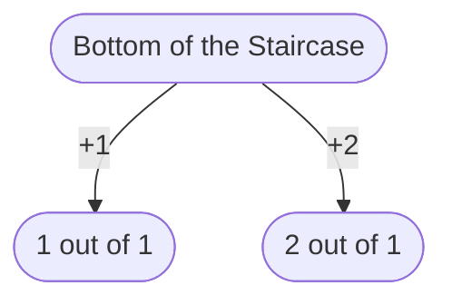
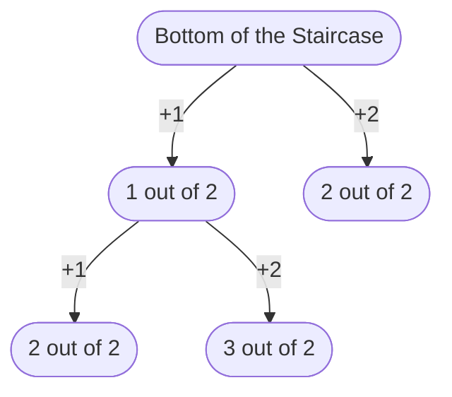
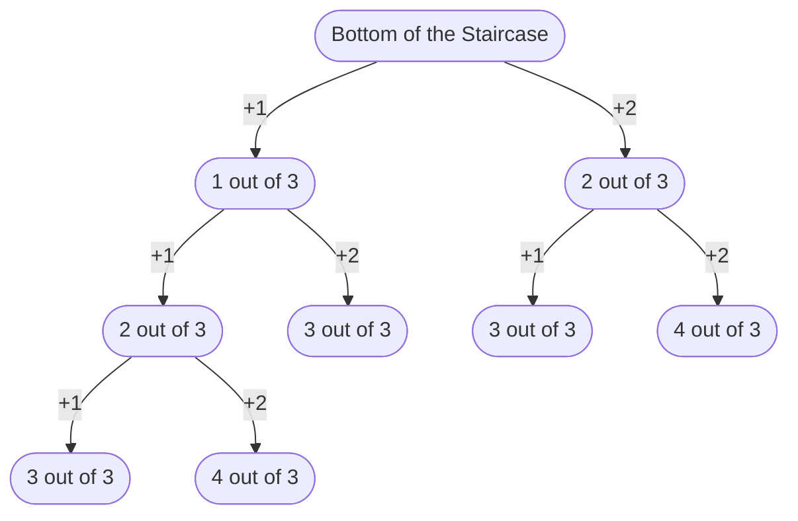
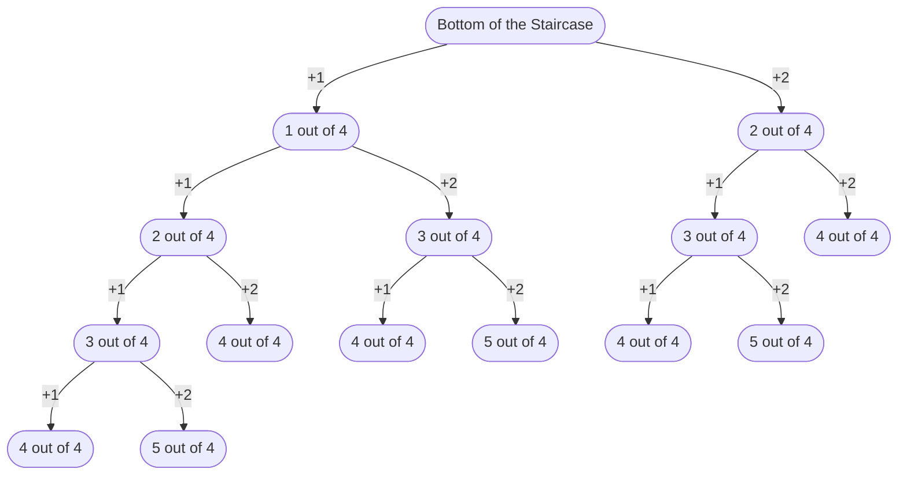

::: slot header

# Climbing Stairs Solution 2

:::

## Links

<a href="https://leetcode.com/problems/climbing-stairs/" target="_blank" rel="noopener noreferrer">Climbing Stairs 
Problem&nbsp;💡
</a>

<a href="https://github.com/codemonkeysio/LeetCode" target="_blank" rel="noopener noreferrer">Get the code & notes on 
GitHub&nbsp;💻
</a>

<a href="https://discord.gg/mh9rQmwJ8H" target="_blank" rel="noopener noreferrer">Ask Questions & Share Solutions in 
Discord&nbsp;🤖
</a>

## Problem Description

You are climbing a staircase. It takes n steps to reach the top.

Each time you can either climb 1 or 2 steps. In how many distinct ways can you climb to the top?

## Examples

Ex 1) Input: n = 2 $\implies$ Output: 2

Explanation: There are two ways to climb to the top. 1. 1 step + 1 step 2. 2 steps

Ex 2) Input: n = 3 $\implies$ Output: 3

Explanation: There are three ways to climb to the top. 1. 1 step + 1 step + 1 step 2. 1 step + 2 steps 3. 2 steps + 1 step

## Constraints

- $1 \leq \color{#ebeb33}{n} \leq 45$

## Thought Process

- We previously came up with a solution for this problem by using a recursive formula that represents how many distinct ways we can climb the stairs.

- The issue with the previous solution is it has a time complexity of O(2n) which is very inefficient.

- To come up with a better solution we'll be drawing out multiple recursion trees to help us see a pattern.

- When n = 1 we have:

- From the diagram we can see there is 1 distinct way to climb to the top when n = 1 since we can ignore the scenarios where we take extra steps.

- When n = 2 we have:

- So, we have 2 distinct ways to climb to the top.

- When n = 3 we have:

- So, we have 3 distinct ways to climb to the top.

- When n = 4 we have:

- So, we have 5 distinct ways to climb to the top.

- Now, let's take a look at our cases from n = 1 to n = 2 and see if we can find a pattern:

$$\color{#ebeb33}{n \; \; \; \; \; \; \; \; \; \; \; \; \; \; \; \; \; \; \; \; \; 1 \; \; 2 \; \; 3 \; \; 4}$$

$$\color{#33ebeb}{waysToClimb \; \; 1 \; \; 2 \; \; 3 \; \; 4}$$

- Here, waysToClimb denotes our function for determining how many unique ways we can climb the stairs.

- This sequence of numbers follows the Fibonacci sequence with the only difference being the value of the 1st and 2nd terms.

- Here, the 1st term has a value of 1 and the 2nd term has a value of 2.

- Also, notice that we know we have two ways to climb the stairs to reach the nth step.

- If we take 1 step, then we're n - 1 steps closer to n, and if we take 2 steps then we're n - 2 steps closer to n.

- So, we can get the distinct number of ways to climb the steps by summing up the ways of climbing to the n - 1 step and the ways of climbing to the n - 2 step using the following formula:

$$\color{#33ebeb}{waysToClimb}(\color{#ebeb33}{n}) = \color{#33ebeb}{waysToClimb}(\color{#ebeb33}{n - 1}) + \color{#33ebeb}{waysToClimb}(\color{#ebeb33}{n - 2}) \; \; for \; \; \color{#ebeb33}{n} > \color{#ebeb33}{2}$$

- The Fibonacci sequence is the following series of numbers:

$$\color{#ebeb33}{0, 1, 1, 2, 3, 5, 8, 13, 21, 34, _{...}}$$

- The next number is found by adding up the two numbers before it.

- For example, 5 is found by adding 2 and 3.

- The first two terms are called seed numbers, which we'll denote as:

$$\color{#ebeb33}{f_0} = \color{#ebeb33}{0}, \color{#ebeb33}{f_1} = \color{#ebeb33}{1}$$

- Here's the formula used to characterize the sequence:

$$\color{#ebeb33}{f_n} = \color{#ebeb33}{f_{n - 1}} + \color{#ebeb33}{f_{n - 2}} \; \; for \; \; \color{#ebeb33}{n} > \color{#ebeb33}{1}$$

- The seed numbers for our problem are:

$$\color{#33ebeb}{waysToClimb_1} = \color{#33ebeb}{1}, \color{#33ebeb}{waysToClimb_2} = \color{#33ebeb}{2}$$

- Now that we know our pattern of climbing the stairs follows a Fibonnaci sequence we can implement the sequence in our code using the waysToClimb formula and the seed numbers we came up with.

- This will improve the time complexity of our solution from the O(2n) solution we previously came up with.

## Implementation

<code-fence lang="js" heading="Climbing Stairs Solution 2">
<pre vue-slot="code">
var climbStairs = function(n) {
  if (n === 1) {
    return 1;
  } else if (n === 2) {
    return 2;
  } else {
    let waysToClimb1 = 1;
    let waysToClimb2 = 2;
    let waysToClimb;
    let i = 1;

    while (n - 1 > i) {
      waysToClimb = waysToClimb2 + waysToClimb1;
      waysToClimb1 = waysToClimb2;
      waysToClimb2 = waysToClimb;
      i++;
    }

    return waysToClimb;
  }
};

let n = 4;
console.log(climbStairs(n));

</pre>
</code-fence>

## Analysis

- Since we're looping over the length of n - 1 our time complexity is O(n) which is a much more efficient solution!

- See if you can come up with an even more efficient solution using more properties of the Fibonnaci sequence!
